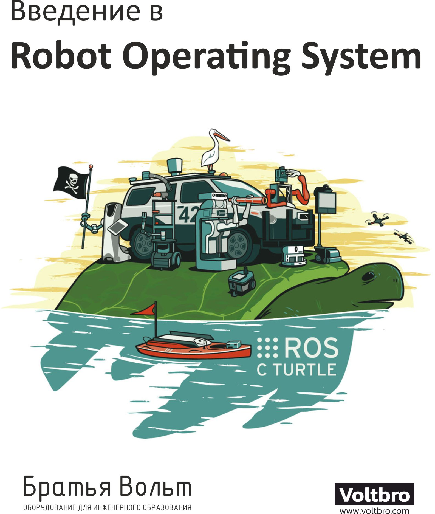

# О книге

## О книге

Материалы книги доступны для свободного использования на сайт [http://docs.voltbro.ru/starting-ros/](http://docs.voltbro.ru/starting-ros/)

Книга доступна для распространения под лицензией "Некоммерческое использование — Без производных произведений" [CC BY-NC-ND 4.0](https://creativecommons.org/licenses/by-nc-nd/4.0/legalcode.ru)

Исходный код в формате .md доступен на [https://github.com/voltbro/starting-ros](https://github.com/voltbro/starting-ros)

### Авторы

* Слабуха Николай, компания "Братья Вольт"
