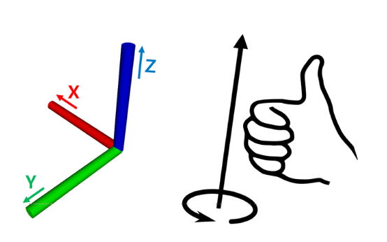
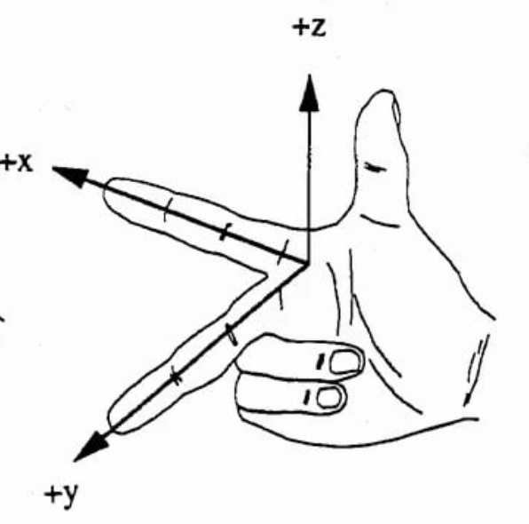

# Стандарты ROS

## Единицы измерений

Данные используемые в ROS, должны соответствовать единицам СИ -- стандарту наиболее широко используемому в мире.

Это указано в рекомендации REP-01031 [http://www.ros.org/reps/rep-0103.html](http://www.ros.org/reps/rep-0103.html). Например, используются длина в метрах, масса в килограммах, время в секундах, ток в амперах, угол в радианах, частота в герцах, сила в ньютонах, мощность в ваттах, напряжение в вольтах и температура в градусах Цельсия.

Все остальные блоки состоят из комбинации вышеупомянутых блоков. Например, скорость перемещения измеряется в метрах / сек, а скорость вращения измеряется в радиан / сек.

Рекомендуется соблюдать соответствие единицам СИ, поскольку это позволит другим пользователям переиспользовать ваш пакет без необходимости дополнительной конвертации.

## Координаты XYZ

Оси x, y и z в ROS используют правило правой руки \(правило буравчика\), как показано на рисунке.

Направление вперед - это положительное направление `оси X`, которое изображено ​​красным. Направление налево представляет собой положительное направление `оси Y`, которое изображено зеленым. Наконец, направление вверх - это положительное направление `оси Z`, а ось обозначена ​​синим. Цветовое кодирование легко запомнить по аббревиатуре RGB \(стандарт представления цвета red-green-blue\), которое соответсвует осям XYZ.

Чтобы запомнить направления, вы можете расположить большой, указательный и средний палец в форме трех осей как показано на рисунке.

## Оси вращения

Следуя правилу буравчика, направление, которое ваша правая рука закручивает - это положительное направление вращения. Например, если робот вращается с 12 до 9 часов, то используя радианы для обозначения угла поворота, мы получаем, что робот вращается на +1.5708 радиан по `оси Z`.

## Стандарты кодирования

`ROS` рекомендует разработчикам следовать единому стандарту оформления кода \(именования и форматирования\). Единый формат кодирования уменьшает количество дополнительной работы, которую разработчики часто должны делать при работе с исходным кодом. В частности это улучшает понимание кода для других участников и облегчает проверку кода.

Правила по соблюдению стандарта не является обязательными, но многие пользователи ROS соглашаются и придерживаются этих правил.

Перечислим принципы именования объектов

| Объект | Правило | Пример |
| :--- | :--- | :--- |
| Пакет \(Package\) | under\_scored | rst\_ros\_package |
| Topic, Service | under\_scored | raw\_image |
| File | under\_scored | turtlebot3\_fake.cpp |
| Variable | under\_scored | string table\_name; |
| Type | CamelCased | typedef int32\_t PropertiesNumber; |
| Class | CamelCased | class UrlTable |
| Structure | CamelCased | struct UrlTableProperties |
| Function | camelCased | addTableEntry\(\); |
| Method | camelCased | void setNumEntries\(int32\_t num\_entries\) |
| Constant | ALL\_CAPITALS | const uint8\_t DAYS\_IN\_A\_WEEK = 7; |
| Macro | ALL\_CAPITALS | \#define PI\_ROUNDED 3.0 |

