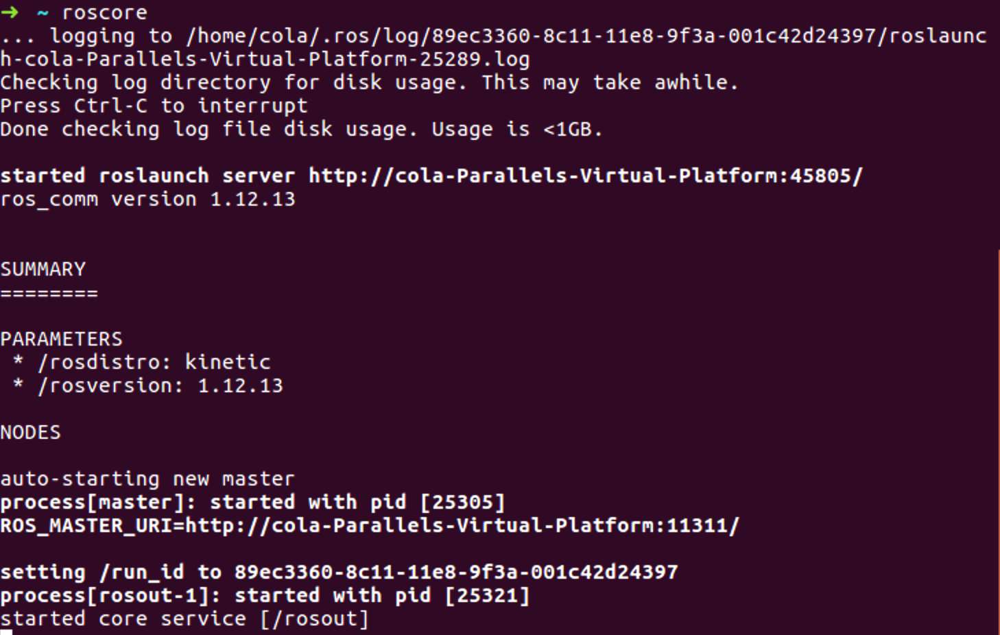

# Установка

Поскольку ROS - это мета-операционная система, вам необходимо выбрать ОС для использования. ROS поддерживает Debian, Ubuntu, Linux Mint, OS X, Fedora, Gentoo, openSUSE, Arch Linux и Windows \(через виртуализацию Linux\), но самыми популярными операционными системами являются Debian, Ubuntu и Linux Mint. В нашем учебнике мы будем использовать ОС Ubuntu. Для слабых компьютеров, рекомендуем использовать ОС Lubuntu \(совместима с Ubuntu\)

На сегодняшний день, актуальным дистрибутивом ROS является **ROS Melodic Morenia** [http://wiki.ros.org/melodic](http://wiki.ros.org/melodic) этот дистрибутив мы и установим.

Оригинальная инструкция по установке ROS находится на сайте ROS [https://www.ros.org/install/](https://www.ros.org/install/). За основу дальнейшей инструкции будет взята страница [http://wiki.ros.org/melodic/Installation/Ubuntu](http://wiki.ros.org/melodic/Installation/Ubuntu).

Для установки ROS на Ubuntu существуют готовые пакеты, нам достаточно добавить репозиторий, содержащий пакеты ROS и установить их обычным для Linux способом.

Если на вашей платформе не существует подготовленных пакетов, то прийдется "собирать" все пакеты из исходного кода, что не сложно, но займет куда более продолжительное время.

## Установка пакетов

#### Добавление репозитория пакетов ROS

Открываем окно терминала \(программа terminal\) \(возможно Ctrl-Alt-T\)

```bash
sudo sh -c 'echo "deb http://packages.ros.org/ros/ubuntu $(lsb_release -sc) main" > /etc/apt/sources.list.d/ros-latest.list'
```

#### Добавление ключей

```bash
sudo apt-key adv --keyserver 'hkp://keyserver.ubuntu.com:80' --recv-key C1CF6E31E6BADE8868B172B4F42ED6FBAB17C654
```

Обратите внимание, что ключ может измениться, поэтому уточните его на официальной Wiki странице [http://wiki.ros.org/melodic/Installation/Ubuntu](http://wiki.ros.org/melodic/Installation/Ubuntu).

#### Обновление списка пакетов

Когда мы добавили и настроили репозиторий с пакетами ROS, мы должны обновить список пакетов доступных системе для установки. Также рекомендуется обновить все установленные пакеты Ubuntu до установки ROS.

```bash
sudo apt-get update && sudo apt-get upgrade -y
```

#### Установка пакетов ROS

На этапе знакомства с ROS, проще всего установить самую полную версию системы. Данный пакет автоматический установит все основные пакеты ROS, rqt, rviz, библиотеки 2D/3D симуляции, навигации и тп.

```bash
sudo apt-get install ros-melodic-desktop-full
```

#### Установка дополнительных пакетов

Если необходимо установить дополнительный пакет, то это можно сделать обычной утилитой установщиком `apt-get`. Например добавить пакет slam-gmapping можно командой.

```bash
sudo apt-get install ros-melodic-slam-gmapping
```

Поиск пакетов выполняется командой

```bash
apt-cache search ros-melodic
```

## Настройка после установки

#### Установка rosdep

Прежде чем использовать ROS, вам необходимо инициализировать `rosdep`. `rosdep` позволяет устанавливать системные зависимости для исходных кодов, который вы хотите скомпилировать и требуется для запуска некоторых основных компонентов в ROS.

```bash
sudo rosdep init
rosdep update
```

### Настройка рабочего окружения

Настройка рабочих параметров ROS, происходит через установку переменных окружения \(например пути библиотек, адреса серверов и тд\). Эту операцию можно делать руками, но проще настроить их автоматический экспорт при запуске интерактивной оболочки bash.

Добавим переменные окружения ROS, для их автоматической установки при запуске bash:

```bash
echo "source /opt/ros/melodic/setup.bash" >> ~/.bashrc
source ~/.bashrc
```

Если вы просто хотите загрузить переменные ROS в текущем сеансе, то вы можете ввести:

```bash
source /opt/ros/melodic/setup.bash
```

Если вы используете zsh вместо bash, то необходимо выполнить команду.

```bash
echo "source /opt/ros/melodic/setup.zsh" >> ~/.zshrc
source ~/.zshrc
```

## Установка дополнительных пакетов для разработчиков

Если вы собираетесь самостоятельно разрабатывать или вносить изменения в пакеты, вам необходимо установить дополнительные пакеты.

```bash
sudo apt-get install python-rosinstall python-rosinstall-generator python-wstool build-essential
```

#### Создание рабочего пространства

ROS использует специальную систему сборки под названием `catkin`. Чтобы использовать ее, вам необходимо создать и инициализировать папку рабочего пространства.

```bash
 mkdir -p ~/catkin_ws/src
 cd ~/catkin_ws/src
 catkin_init_workspace
```

## Первый запуск

Установка для ROS завершена, следующая команда запустит сервер \(главную ноду\) ROS. Закройте все окна терминала и откройте новое окно терминала.

```bash
roscore
```

Если ROS установлена верно, то мы увидим приблизительно такое сообщение при запуске:



Для остановки `roscore` необходимо нажать Ctrl+C

Если вы хотите чтобы `roscore` запустился в фоновом режиме, то запустите его командой

```bash
roscore &
```

