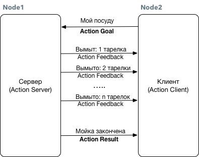

# Работа с Action

Модель коммуникации в режиме Действие \(Action\) используется, когда выполнение запрошенной команды занимает продолжительное время, и необходима обратная связь с процессом. Это очень похоже на модель Service: \(Service Request\) используется как Задача \(Action Goal\) а ответ \(Service Response\) используется как Результат \(Action Result\). Также есть дополнительная сущность Обратная Связь \(Action Feedback\) для передачи промежуточных результатов для клиента.



Например, как показано на рисунке, если клиент устанавливает цель -- мыть посуду, сервер информирует клиента о ходе мытья посуды форме обратной связи, и после окончания обработки, отправляет клиенту сообщение об окончании процесса.

В отличие от службы \(Service\), действие \(Action\) часто используется для управления сложными задачами робота, такими как передвижение к заданной точке, запуск лазерного сканирования и т.п.

### Файл описания действия \(Action\) .action

Файлы описания действия \(Action\) находятся в директории `./action` пакета имеют расширение `.action`, и выглядят приблизительно так:

```text
# Определение цели (goal)
uint32 dishes  # Сколько мыть тарелок
---
# Определение результата (result)
uint32 total_dishes_cleaned # Сколько всего было вымыто
---
# Определение обратной связи (feedback)
uint32 dishes_cleaned # Сколько вымыто посуды сейчас
```

На основе этого файла .action создаются 6 вспомогательных сообщений, чтобы клиент и сервер могли общаться. Это преобразование автоматически запускается во время процесса сборки пакета.

Для файла `DoDishes.action` будут созданы файлы

```text
DoDishesAction.msg
DoDishesActionGoal.msg
DoDishesActionResult.msg
DoDishesActionFeedback.msg
DoDishesGoal.msg
DoDishesResult.msg
DoDishesFeadback.msg
```

Дополнительная информация о работе с Действиями \(Action\) доступна на станице ROS wiki [http://wiki.ros.org/actionlib](http://wiki.ros.org/actionlib)

## Примеры работы на Python

### Action Server

Сервер получает задачу от клиента с параметрами, запускает процесс выполнения и информирует клиента об промежуточных результатах. После выполнения задачи, сервер сообщает клиенту об успешном завершении.

Для действия описанного в файле `DoDishes.action` пакета `ros_book_samples` напишем пример сервера `action_server.py`

```python
#! /usr/bin/env python
# -*- coding: utf-8 -*-

import roslib
import rospy
import actionlib

from ros_book_samples.msg import DoDishesAction, DoDishesResult, DoDishesFeedback

class DoDishesServer:
    # Определяем обьекты Обратная связь и Результат
    _feedback = DoDishesFeedback()
    _result = DoDishesResult()

    def __init__(self):
        # Создаем и запускаем SimpleActionServer для обработки запросов
        self.server = actionlib.SimpleActionServer('do_dishes', DoDishesAction, self.execute, False)
        self.server.start()

    def execute(self, goal):
        # Определяем внутренние переменные каждого запроса
        r = rospy.Rate(1) # эмулируем задержку в 1 секунду на выполнение
        self.clear_dishes = 0

        # Моем каждую тарелку
        for i in range(1, goal.dishes+1):
            self.server.publish_feedback(DoDishesFeedback(i))
            self.clear_dishes+=1
            r.sleep()
        # После завершения цикла информируем клиента об окончании работы
        self.server.set_succeeded(DoDishesResult(self.clear_dishes))


if __name__ == '__main__':
    rospy.init_node('do_dishes_server')
    server = DoDishesServer()
    rospy.spin()
```

Полное описание класса `SimpleActionServer` доступно [http://www.ros.org/doc/api/actionlib/html/classactionlib\_1\_1simple\_\_action\_\_server\_1\_1SimpleActionServer.html](http://www.ros.org/doc/api/actionlib/html/classactionlib_1_1simple__action__server_1_1SimpleActionServer.html)

### Action Client

Клиент создает задачу на сервере, обрабатывает обратную связь и выводит финальный результат.

```python
#! /usr/bin/env python
# -*- coding: utf-8 -*-

from __future__ import print_function

import rospy
import actionlib

# Подключение классов DoDishesAction и DoDishesGoal из пакета ros_book_samples
from ros_book_samples.msg import DoDishesAction, DoDishesGoal

# Функция для обработки сигнала Обратной связи (Action Feadback)
def action_feedback(fb):
    print(fb)

# Функция клиента
def action_client():
    # Создаем клиента для работы с Действиями с именем do_dishes
    client = actionlib.SimpleActionClient('do_dishes', DoDishesAction)

    # Ожидание подключение к серверу
    client.wait_for_server()

    # Создание задачи на 10 тарелок
    goal = DoDishesGoal(dishes=10)

    # Отправка задачи на сервер и определение метода обработки для Обратной связи (Action Feadback)
    client.send_goal(goal, feedback_cb=action_feedback)

    # Ожидание результата (Action Result) работы сервера
    client.wait_for_result()

    # Возвращаем полученный от сервера результат
    return client.get_result()

if __name__ == '__main__':
    try:
        # Инициализация ноды и запуск SimpleActionClient
        rospy.init_node('book_action_client_py')
        result = action_client()
        print("Result:", result)
    except rospy.ROSInterruptException:
        print("program interrupted before completion", file=sys.stderr)
```

Описание класса `SimpleActionClient` доступно [http://www.ros.org/doc/api/actionlib/html/classactionlib\_1\_1simple\_\_action\_\_client\_1\_1SimpleActionClient.html](http://www.ros.org/doc/api/actionlib/html/classactionlib_1_1simple__action__client_1_1SimpleActionClient.html)

Запуск примеров возможен или через прямой запуск скриптов `python` или через запуск `rosrun`

```bash
rosrun ros_book_samples action_server.py
rosrun ros_book_samples action_client.py
```

При правильной работе Клиента и Сервера в консоле с задержкой в 1 секунду выведутся номера тарелок и финальный результат.

```bash
rosrun ros_book_samples action_client.py

dishes_cleaned: 1
dishes_cleaned: 2
dishes_cleaned: 3
dishes_cleaned: 4
dishes_cleaned: 5
dishes_cleaned: 6
dishes_cleaned: 7
dishes_cleaned: 8
dishes_cleaned: 9
dishes_cleaned: 10
Result: total_dishes_cleaned: 10
```

## Использование модели Action в новых пакетах

Для использования `Actionlib` в новых пакетах, необходимо удостовериться, что установлены все зависимости и внесены изменения в конфигурацию `make`.

В файле `CMakeLists.txt` необходимо внести изменения

```text
find_package(catkin REQUIRED genmsg actionlib_msgs actionlib)
add_action_files(DIRECTORY action FILES DoDishes.action)
generate_messages(DEPENDENCIES actionlib_msgs)
```

В файле `package.xml` должны быть подключенны зависимости

```markup
<build_depend>actionlib</build_depend>
<build_depend>actionlib_msgs</build_depend>
<exec_depend>actionlib</exec_depend>
<exec_depend>actionlib_msgs</exec_depend>
```

## Дополнительная информация

Модуль ActionLib имеет довольно сложную структуру взаимодействия и выполнения задач. Как Сервер, так и Клиент обрабатывают запросы по принципу Машины состояния \(State Machine\). Задачи могут отменяться, останавливаться и заново запускаться. Подробное описание этого взаимодействия описано на Wiki странице [http://wiki.ros.org/actionlib/DetailedDescription](http://wiki.ros.org/actionlib/DetailedDescription)

Не так важно сейчас в этом полностью разобраться, как важно знать, что эти механизмы существуют и обратиться к документации, когда это будет необходимо.

