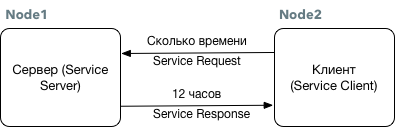

# Работа с Service

Модель коммуникации в режиме Сервис представляет собой двунаправленную синхронную связь между клиентом \(Service Client\), создающим запрос, и сервером \(Service Server\), отвечающим на запрос.

Данный способ удобно использовать для периодической передаче данных, или когда существует потребность в синхронной связи \(режим запрос-ответ\).

Сервер отвечает только тогда, когда есть запрос \(Service Request\) и клиент, который может получать ответы \(Service Response\). В отличие от работы с топиками, модель сервис работает с "одноразовыми" соединениями. Поэтому, когда цикл запрос и ответ завершен, соединение между двумя нодами будет отключено.

