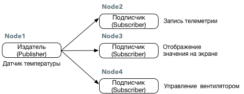

# Работа с Topic

Модель работы в режиме Topic, подразумевает использование одного типа сообщения как для Издателя \(Publisher\) и подписчика \(Subscriber\).

Модель Topic являются однонаправленной и подразумевает непрерывную отправку или получение сообщений. Такой способ коммуникации подходит для датчиков, которым требуются периодическая публикация сообщений. Несколько подписчиков могут получать сообщения от одного издателя и наоборот. Также возможна работа несколько издателей.

На изображении ниже показана модель работы датчика температуры, когда его данные получают различные ноды.



### Примеры работы на Python

Для работы с топиками мы будем использовать библиотеку **rospy.Publisher Code API** [http://docs.ros.org/api/rospy/html/rospy.topics.Publisher-class.html](http://docs.ros.org/api/rospy/html/rospy.topics.Publisher-class.html)

Вы можете создать обработчик для публикации сообщения в Топик с помощью класса `rospy.Publisher`. После инициализации, вы можете пубдликовать сообщения, например:

```python
pub = rospy.Publisher('topic_name', std_msgs.msg.String, queue_size=10)
pub.publish(std_msgs.msg.String("foo"))
```

В данном примере:

* `topic_name`Название топика для публикации сообщений
* `std_msgs.msg.String` Тип передаваемого сообщения
* `"foo"`переданное сообщение

Полный пример кода Издателя \(publisher\) `src/hello_topic_publisher.py` :

```python
#!/usr/bin/env python
# -*- coding: utf-8 -*-

import rospy
from std_msgs.msg import String

pub = rospy.Publisher('hello', String, queue_size=10)
rospy.init_node('hello_topic_publisher')
r = rospy.Rate(10) # 10hz

while not rospy.is_shutdown():
    pub.publish("Hello World")
    r.sleep()

```

Для приема сообщениями необходимо воспользоваться **rospy.Subscriber Code API** [http://docs.ros.org/api/rospy/html/rospy.topics.Subscriber-class.html](http://docs.ros.org/api/rospy/html/rospy.topics.Subscriber-class.html)

Пример реализации подписчика \(subscriber\) `src/hello_topic_subscriber.py`

```python
#!/usr/bin/env python
# -*- coding: utf-8 -*-

import rospy
from std_msgs.msg import String

def callback(data):
    rospy.loginfo("I heard %s",data.data)

def subscriber():
    rospy.init_node('hello_topic_subscriber')
    rospy.Subscriber("hello", String, callback)
    # spin() simply keeps python from exiting until this node is stopped
    rospy.spin()

if __name__ == '__main__':
    subscriber()

```

Более подробную информацию по работе с топиками на Python можно посмотреть на Wiki странице ROS [http://wiki.ros.org/rospy/Overview/Publishers%20and%20Subscribers](http://wiki.ros.org/rospy/Overview/Publishers%20and%20Subscribers)

### Консольная утилита rostopic

`rostopic` это специальная консольная утилита, предназнаенная для отображения отладочной информации о топиках в ROS. С ее помощью удобно искать нужные топики, и выводить сообщения в консоль для отладки.

Список основных используеммых комманд:

```text
rostopic bw     Показать используеммый сетевой канал
rostopic echo   Вывести сообщения на экран
rostopic find   Поиск топика по типу
rostopic hz     Показать частоты обновления топика
rostopic info   Показать информацию о топике
rostopic list   Показать список существующий топиков
rostopic pub    Опубликовать данные в топик
rostopic type   Показать тип сообщения для топика
```

#### Примеры использования

Вывести список существующий топиков

```text
rostopic list
```

Вывести сообщения из топика `topic_name`

```text
rostopic echo /topic_name
```

#### rostopic pub {#rostopic_pub}

Отправить тектовое сообщение в топик

```text
rostopic pub my_topic std_msgs/String "hello there"
```

Отправить сообщение типа `geometry_msgs/Twist`в топик /cmd\_vel с частоой 10hz

```text
rostopic pub -r 10 /cmd_vel geometry_msgs/Twist  '{linear:  {x: 0.1, y: 0.0, z: 0.0}, angular: {x: 0.0,y: 0.0,z: 0.0}}'
```

Более подробная информация доступна на Wike странице [http://wiki.ros.org/rostopic](http://wiki.ros.org/rostopic)

